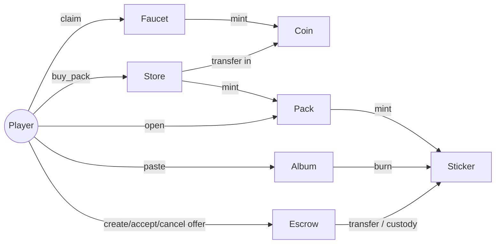

# Architecture

`stellar-album` is built from **7 Soroban contracts** (Rust), organized as a Cargo workspace with one crate per contract plus an integration-test crate. This document describes each contract, the authority graph that ties them together, and the technical mechanics that matter.

## The 7 contracts

| Contract | Role | Token kind | Built with |
|---|---|---|---|
| **Coin** | In-game currency | Fungible | OpenZeppelin `fungible` (Base + Mintable) |
| **Sticker** | The collectibles | Semi-fungible (multi-token) | **Hand-rolled** (`Map<(Address,u32),i128>`) |
| **Pack** | Buyable, opens into 3 stickers | NFT | Custom |
| **Album** | Personal collection | Soulbound NFT | OpenZeppelin `non-fungible` (transfer blocked) |
| **Store** | Sells packs for Coin | — | Custom |
| **Escrow** | Sticker↔sticker trade | — | Custom |
| **Faucet** | Drips Coin | — | Custom (mints Coin) |

## Why these library choices

We checked the **OpenZeppelin `stellar-tokens`** library. As of this writing it ships: `fungible` (Base + extensions), `non-fungible` (Base / Consecutive / Enumerable), `RWA`, and `vault`.

- The **`vault`** module is a **Fungible Token Vault (ERC-4626 style)** — you deposit a fungible token and receive shares. It has **no concept of a `token_id`**, so it does **not** fit the semi-fungible sticker. (This was a tempting-but-wrong lead.)
- There is **no ERC-1155 / multi-token / semi-fungible** module in the library.

Consequences:
- **Sticker is hand-rolled.** This is *better* for teaching — students build the "1155 from scratch" and see exactly what an abstraction would hide.
- **Album reuses OZ `non-fungible` Base** (it's a genuine NFT, one per owner) with transfer blocked to make it soulbound.
- **Coin reuses OZ `fungible`** so the Faucet can be a contract-level minter (see [decisions](decisions.md) on why we chose this over a classic-asset SAC).

---

## Contract details

### Coin
- OpenZeppelin `fungible` Base + **Mintable**.
- Stores a `minter: Address` in instance storage; only the minter can `mint`.
- At init: `set_minter(faucet_addr)` — the **Faucet is the sole minter**.
- Trade-off (accepted for a demo): minting means **supply is effectively infinite** and visibly inflates on-chain. A pre-funded treasury would be finite/"more real", but minting is simpler to operate and demonstrating mint is itself didactic. Not a production design.

### Sticker
The semi-fungible heart of the project. Hand-rolled multi-token (~150–250 lines).

```rust
#[contracttype]
enum DataKey {
    Balance(Address, u32),   // (owner, type_id) -> i128
    Supply(u32),             // type_id -> total minted
    Admin,
}
```

Public surface:
- `balance_of(owner, type_id) -> i128`
- `mint(to, type_id, amount)` — minter only (the **Pack** contract)
- `transfer(from, to, type_id, amount)` — `from` authorizes
- `burn(from, type_id, amount)` — used by the **Album** when pasting

20 sticker types, each with a rarity tier (see [economy-and-rarity.md](economy-and-rarity.md)). A duplicate is simply `balance > 1` for a given `type_id`.

### Pack
A holding of sealed packs. Sealed packs are interchangeable, so an owner holds a **fungible count** of them (`Balance(Address)`), not numbered NFTs — see [decision D16](decisions.md). Opening one collapses that fungibility into unique stickers.
- `open(owner)` is the centerpiece: it **burns** the pack, draws 3 results with `env.prng()` (repetition within a pack is allowed), and performs a **cross-contract call** to `Sticker.mint` three times.
- The Pack contract must be the **configured minter** of Sticker.
- **Randomness caveat (taught, not hidden):** `env.prng()` is **grindable** — a user can simulate the open transaction, see the outcome, and only submit when the draw is good (a free re-roll). This is acceptable for a testnet demo and is turned into explicit course content (the attack + mitigations). See [Class 3](curriculum/class-3-pack-album.md) and [decisions](decisions.md).

### Album
A soulbound, per-owner collection — one per person, carrying slot state.
- **Hand-rolled**, not OZ `non-fungible` — see [decision D17]. Soulbound by construction: there is **no transfer function**.
- `open_album(owner)` mints the (empty) album; one per person.
- `paste(owner, type_id)`: **burns** the sticker (cross-contract call to `Sticker.burn`, of which the Album is the burner) and marks the slot filled. **Irreversible** — a pasted sticker can never be traded again.
- Storage tracks album existence, per-`(owner, type)` filled slots, and a filled count.

[decision D17]: decisions.md

### Store
- `buy_pack(buyer)`: pulls Coin from the buyer (pack price = 100 Coin) and **mints a Pack** to them.
- Must be the configured minter of Pack.

### Escrow
Asynchronous, sticker↔sticker only (no Coin on either side).

```rust
pub struct Offer {
    pub maker: Address,
    pub give_type: u32,   // sticker the maker deposits (held in custody)
    pub want_type: u32,   // sticker the maker wants
}
```

Trades are **1-for-1** (one sticker for one sticker); there are no amounts.

Write surface:
- `create_offer(maker, give_type, want_type) -> u64`: `maker` authorizes; the contract **pulls the offered sticker into custody** (transfer to the contract) and returns the new offer id. The sticker leaves the maker's balance immediately.
- `accept_offer(taker, offer_id)`: `taker` authorizes. **Checks-effects-interactions** — remove the offer *before* moving assets — then two transfers: custody→taker and taker→maker. Atomic; if any leg fails the whole tx reverts.
- `cancel_offer(offer_id)`: maker (read from the stored offer) authorizes; returns the custodied sticker to the maker.

Read surface (lets the frontend render a visual marketplace instead of asking users to type an offer number):
- `has_offer(offer_id) -> bool`: existence check.
- `get_offer(offer_id) -> Option<Offer>`: one offer's contents, or `None` if accepted/cancelled.
- `offers() -> Vec<OfferView>`: every currently-open offer with its id (`OfferView { id, maker, give_type, want_type }`), by scanning `0..Counter`. Accepted/cancelled ids are simply absent.

Gotchas (all good teaching material): orphaned offers (no expiry → manual cancel), double-accept (the offer is removed before assets move, so a second accept traps with "no such offer"), and reentrancy discipline (state change before transfers).

### Faucet
- `claim(addr)`: checks `env.ledger().timestamp() - last_claim[addr] >= cooldown`, mints Coin to `addr`, updates `last_claim`.
- Cooldown is **parametrizable** (admin-settable in storage): ~60s in a live-classroom mode, 3h in a self-paced "campaign" mode.
- Sybil note: cooldown is per-address, so it is **not** real anti-abuse (one dev can create many accounts). Fine for a demo; itself a teachable point.

---

## Authority graph

The single most error-prone part of a multi-contract system. Each edge is a `require_auth` that must check the **right parent contract**, not the end user.

```
Faucet  ──mint──►   Coin       (Faucet is Coin's minter)
Store   ──mint──►   Pack       (Store is Pack's minter)
Pack    ──mint──►   Sticker    (Pack is Sticker's minter)
Album   ──burn──►   Sticker    (Album is Sticker's burner)
Escrow  ──transfer──► Sticker  (custody; Escrow never mints)
```



Each authority edge is an admin-settable address (`set_minter` / `set_burner` /
`set_sticker` / …) so the graph is **reconfigurable after deploy** (UPG-2,
[decision D26](decisions.md)). Every stateful contract is also **upgradeable in
place** (admin-gated `upgrade(wasm_hash)`, UPG-1, [decision D24](decisions.md)),
so a fix preserves contract ids and state instead of forcing a redeploy.

The #1 cross-contract mistake is leaving `mint`/`burn` open so anyone can call it. Each privileged function must verify the auth of its **configured** caller address (e.g. `Sticker.mint` checks the auth of the Pack contract address set at init).

## Implementation risks to watch

1. **TTL / archival of persistent storage.** Sticker balances and Album slots live in *persistent* storage. Without `extend_ttl` on writes, entries archive after some ledgers and break silently later. Standardize a TTL-extend helper from the Sticker contract onward. **This is verified on testnet, not in unit tests** — the default test env does not simulate archival. See [implementation-plan.md](implementation-plan.md#hard-rule-2--ttl--archival-is-a-testnet-runtime-gate-not-a-unit-test) (Hard Rule 2).
2. **Cross-contract authority wiring at bootstrap.** A wrong or forgotten `set_minter` only fails at runtime (in integration tests), not at compile time. The integration-test crate must cover every edge of the authority graph early.

See [bootstrap-and-deploy.md](bootstrap-and-deploy.md) for the deploy ordering that makes the authority graph valid.

## Where each contract is built

Each contract maps to a build phase and ships on a class branch (full detail in [implementation-plan.md](implementation-plan.md)):

| Contract | Phase | Ships on |
|---|---|---|
| Coin | 1 | `class-1-coin-faucet` |
| Faucet | 2 | `class-1-coin-faucet` |
| Sticker | 3 | `class-2-stickers` |
| Pack | 4 | `class-3-packs-album` |
| Store | 5 | `class-4-store-escrow` |
| Album | 6 | `class-3-packs-album` |
| Escrow | 7 | `class-4-store-escrow` |
